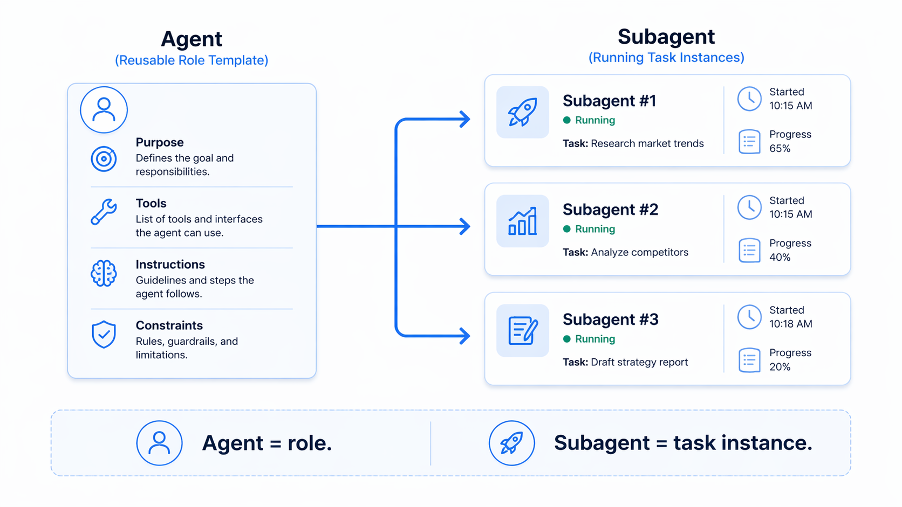
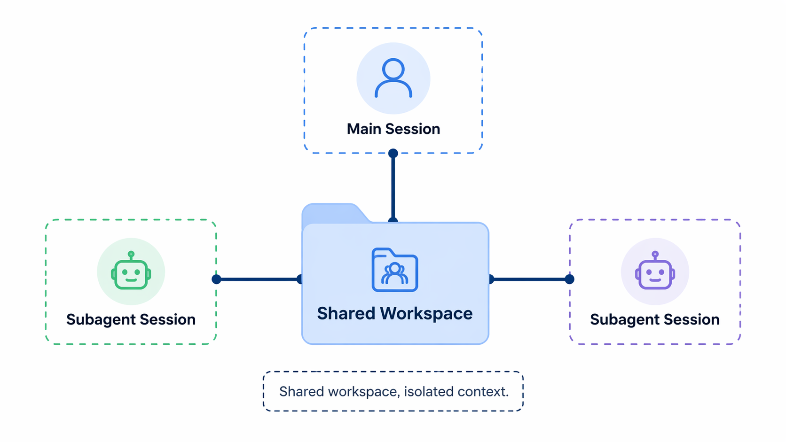
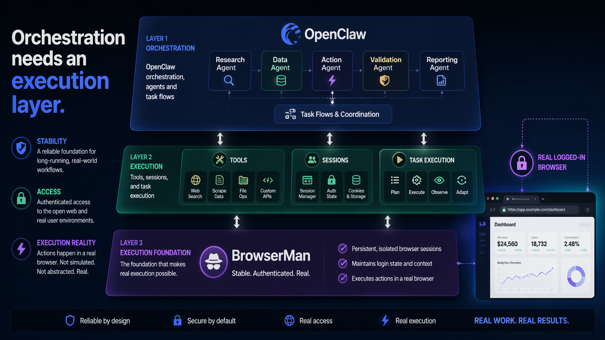

When people start using agent systems seriously, they quickly run into a vocabulary problem.

What is an agent?
What is a subagent?
What is a session?
What is a workspace?
And why does all of this start feeling messy the moment real work begins?

These terms sound interchangeable, but they are not. If you miss the distinction, everything after that gets harder:

- when to split a task into a subagent
- why a subagent feels isolated but still edits the same files
- what is a role vs what is a running instance
- why multi-agent systems eventually hit the browser and login-state wall

This is the practical version.

## Agent is a role, not a single running conversation

The easiest mistake is to think an agent is just a chat window.

It is usually closer to a role definition:

- how it behaves
- what tools it can use
- what kinds of work it should handle
- what boundaries it operates within

So an agent is more like a reusable operating profile than a single execution.

In a real system, you might have:

- a main agent
- a coding agent
- a research agent
- an ops agent

Those are not just different threads. They are different roles.

## Subagent is a task instance, not a new species of agent

A subagent is usually an isolated execution instance launched from a parent session.

That distinction matters.

- **Agent** = role / configuration / capability boundary
- **Subagent** = a concrete instance running a task

A useful mental model:

- agent = job description
- subagent = the person temporarily assigned to do a piece of work

That is why subagents are valuable even when they are not “smarter”:

- they isolate context
- they can run in parallel
- they keep the main session cleaner
- they are good for decomposition

## Workspace is often shared; context is what gets isolated

This is the second thing that surprises people.

A subagent often does **not** get a completely separate workspace by default.

What usually happens instead is:

- the workspace is shared
- the session is isolated
- the execution flow is isolated
- the task lifecycle is isolated

So yes, a subagent can feel independent while still operating in the same project directory.

That apparent contradiction is normal.

The isolation is often in:

- conversation state
- tool-call flow
- intermediate work process
- task lifetime

Not necessarily in the filesystem.

## Multi-agent systems do not fail because they need more agents

They usually fail because they do not have a clean shared execution layer.

Once you understand agents, subagents, and workspaces, the next question becomes obvious:

**What exactly is shared across all these agents?**

Not just files.

What about:

- browser state
- login sessions
- permissions
- auditability
- external execution context

This is where many agent stacks get awkward.

On paper, it sounds simple:

- one agent researches
- one agent writes
- one agent publishes
- one agent handles replies

But in practice, these agents quickly collide on the same issue:

**Who gets to use the real browser?**

## The browser is where abstract architecture becomes operational reality

Most agent systems are still weak at the layer that matters most for real work:

- authenticated browsing
- real user sessions
- remote execution with local trust boundaries
- repeatable action across multiple agents

Local browser tools give you real session state, but are awkward for remote agents. Cloud browser setups are easy to run remotely, but do not have the user’s real session by default. And once several agents need the same logged-in environment, things become fragile fast.

This is where the architecture stops being philosophical. It becomes operational.

## What a useful multi-agent stack actually needs

A useful multi-agent system needs more than orchestration.

It needs a shared execution layer that is:

- real
- permissioned
- auditable
- revocable
- usable by different agents without handing over the entire machine

For browser-based work, that means:

- the browser stays with the user
- the login state stays with the user
- the agents can run remotely
- access is scoped
- actions are inspectable
- permissions can be revoked

That is the difference between “multiple agents talking” and “multiple agents actually getting work done.”

## Where BrowserMan fits

BrowserMan is not another orchestration layer.

It is the browser execution layer for agents.

You can think of it as the missing piece between:

- agent systems that know what to do
- and real browser environments where the work actually happens

For OpenClaw users, that framing matters.

OpenClaw can orchestrate sessions, tools, and subagents. But when the task depends on the user’s real logged-in browser state, you still need a clean way to delegate browser access.

That is what BrowserMan is built for.

In practice, the stack starts to make sense:

- the main agent plans
- subagents split and execute tasks
- a content agent drafts content
- an ops agent publishes
- an inbox agent handles replies
- BrowserMan provides the real browser layer those agents can safely use

That is a much more useful multi-agent story than just “more agents.”

## Final thought

If you are still asking, “What is the difference between an agent and a subagent?” that is not a beginner question. It is a systems question.

Because once you answer it, the next realization is unavoidable:

The hard part of multi-agent systems is not creating more agents. It is giving them a stable, real, shared execution environment.

And for many real workflows, the browser is where that problem shows up first.

For OpenClaw users, that is not a side topic. It is core infrastructure.
