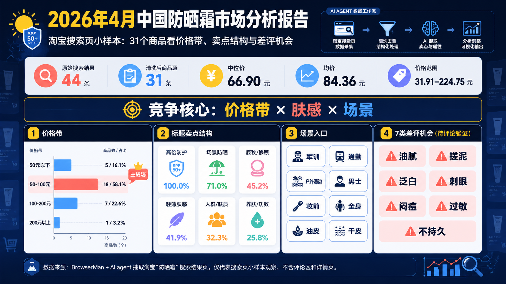

> 这是一份由 AI agent 辅助生成的市场观察报告。数据来自 2026 年 4 月一次淘宝“防晒霜”搜索结果页小样本：原始搜索结果 44 条，清洗后商品项 31 条。它不是全网统计，也不是完整行业白皮书；它更适合作为一个“从真实电商页面快速识别市场信号”的样板。

在上一篇文章 [《How to Use AI Agents for Market Analysis: A Taobao Workflow》](/blog/ai-agent-taobao-sunscreen-market-analysis/) 中，我们解释了如何让 AI agent 先进入真实市场页面，再做分析：搜索、抽取、清洗、聚类、区分事实和假设。

这篇文章是那套方法的成果型版本。

我们不从“AI 很厉害”开始，而是直接看市场：2026 年 4 月，中国淘宝防晒霜搜索页到底透露了什么？

## 一句话结论

淘宝防晒霜市场的竞争，已经不再是简单的“高倍防晒”。

更准确地说，它正在变成：

> **价格带竞争 × 肤感竞争 × 场景竞争。**

在我们清洗后的 31 个搜索结果商品中，50-100 元价格带占比最高；几乎所有商品都强调高倍防护，但真正拉开差异的是“清爽不油腻”“防水防汗”“军训/户外/通勤”“妆前/隔离/提亮”“男士/学生/油皮”等二级卖点。

这意味着，防晒霜品牌和内容团队如果还只围绕“SPF50”“防紫外线”做表达，会很快陷入同质化。

更好的切口是：

> 用户在什么场景里需要防晒？他们最怕这瓶防晒带来什么糟糕体验？

## 样本说明：这份报告看到了什么，没看到什么

本次分析基于 BrowserMan 执行淘宝搜索任务后获得的数据。

关键词：

> 防晒霜

当前可稳定抽取字段包括：

- 商品标题；
- 价格；
- 销量文本，例如“90万+人付款”；
- 店铺；
- 商品链接；
- 搜索结果排序。

数据范围：

| 项目 | 数值 |
|---|---:|
| 原始搜索结果 | 44 条 |
| 清洗后商品项 | 31 条 |
| 最低价格 | 31.91 元 |
| 最高价格 | 224.75 元 |
| 中位价 | 66.90 元 |
| 均价 | 84.36 元 |

需要明确的是：这份报告还没有使用商品详情页、评论区、差评文本、主图 OCR 或多页 200 商品样本。

所以它的价值不是“最终答案”，而是快速读出搜索结果页中的市场结构。

## 发现一：50-100 元是搜索页主战场

清洗后的 31 个商品价格分布如下：

| 价格带 | 商品数 | 占比 | 中位价 |
|---|---:|---:|---:|
| 50 元以下 | 5 | 16.1% | 43.90 元 |
| 50-100 元 | 18 | 58.1% | 63.26 元 |
| 100-200 元 | 7 | 22.6% | 132.74 元 |
| 200 元以上 | 1 | 3.2% | 224.75 元 |

最值得注意的是 50-100 元区间。

这个区间占据了样本中的 58.1%。它不是单纯的低价带，而是一个高度混合的竞争区：大众基础款、进口品牌、国货品牌、大容量产品、军训防晒、户外防晒、面部/身体两用产品，都在这里竞争。

100-200 元区间更像品牌主力区。安热沙、黛珂、资生堂、兰蔻等品牌更容易出现在这个范围。

这给品牌方一个直接问题：

> 如果你卖 50-100 元，你凭什么在拥挤的主战场里被点击？如果你卖 100 元以上，你凭什么让用户相信这不是溢价？

## 发现二：高倍防护已经是入场券，不是差异化

我们把商品标题按卖点词做了粗分类：

| 标题信号 | 命中商品数 | 占比 |
|---|---:|---:|
| 高倍防护 | 31 | 100.0% |
| 场景防晒 | 22 | 71.0% |
| 底妆 / 修颜 | 14 | 45.2% |
| 轻薄肤感 | 13 | 41.9% |
| 人群 / 肤质 | 10 | 32.3% |
| 养肤 / 功效 | 8 | 25.8% |

“高倍防护”在样本中 100% 命中，说明它已经是防晒品类的基础语言。SPF、防紫外线、高倍、防晒、隔离，这些词需要出现，但很难单独构成差异。

更有价值的是后面的词：

- 清爽；
- 不油腻；
- 水感；
- 啫喱；
- 防水防汗；
- 军训；
- 户外；
- 通勤；
- 妆前；
- 提亮；
- 男士；
- 学生；
- 油皮；
- 干皮。

这些词说明，防晒霜不是一个单一需求，而是一组“使用场景 + 使用体验”的组合。

## 发现三：场景词是下一轮内容竞争入口

如果只写“防晒霜推荐”，内容很容易进入红海。

但淘宝标题给出了更细的入口：

- 军训防晒；
- 通勤防晒；
- 户外 / 海边防晒；
- 男士防晒；
- 妆前防晒；
- 全身大容量防晒；
- 油皮清爽防晒；
- 干皮保湿防晒。

这些不是简单的 SEO 长尾词，而是用户决策场景。

同一个用户在通勤、军训、海边、上妆前、运动时，对“好防晒”的定义并不一样。

所以内容团队真正应该做的，不是继续堆防晒成分和 SPF 解释，而是把用户场景拆开：

| 场景 | 用户真正担心的事 | 内容机会 |
|---|---|---|
| 军训 / 户外 | 晒黑、流汗、不持久 | 防水防汗测试、补涂指南 |
| 通勤 | 厚重、油腻、麻烦 | 轻薄日常防晒清单 |
| 妆前 | 搓泥、不贴妆、泛白 | 妆前防晒避坑指南 |
| 男士 | 油腻、假白、麻烦 | 男士清爽防晒选择逻辑 |
| 油皮 | 闷痘、出油、成膜差 | 油皮防晒评价维度 |
| 干皮 | 拔干、卡粉、不舒服 | 保湿型防晒对比 |

这就是“结果型内容”应该给出的东西：不是告诉读者市场很大，而是告诉读者怎么切市场。

## 发现四：差评机会藏在正向卖点背后

当前样本还没有读取评论区，所以我们不能说“差评中已经统计出这些问题”。

但标题中的正向卖点，已经能反推出下一步评论挖掘方向。

当很多商品都强调“清爽”“不油腻”“防水防汗”“妆前”“油皮可用”，它们很可能是在回应用户已经存在的顾虑。

下一步最值得验证的 7 类差评机会是：

1. **油腻 / 闷**：用户不喜欢厚重膜感；
2. **搓泥 / 不贴妆**：妆前防晒的核心负反馈；
3. **泛白 / 假白**：尤其影响男士、通勤和自然妆感人群；
4. **刺眼 / 熏眼睛**：防晒产品常见但容易被忽视的体验问题；
5. **闷痘 / 致痘**：油皮和敏感肌用户的购买阻力；
6. **过敏 / 刺激**：成分和肤质适配问题；
7. **不防水 / 不持久 / 补涂麻烦**：户外和军训场景的关键痛点。

这些问题如果能通过评论数据验证，就会变成非常强的产品机会和内容机会。

## 发现五：防晒市场正在从“产品词”走向“任务词”

一个有意思的变化是，标题里越来越多词不是描述产品，而是描述任务。

比如：

- 军训；
- 户外；
- 通勤；
- 妆前；
- 全身；
- 男士；
- 学生。

这说明用户不是在抽象地购买“防晒霜”，而是在购买某个具体任务的解决方案：

> 我要军训不晒黑。  
> 我要通勤不油腻。  
> 我要上妆不搓泥。  
> 我要户外不脱防晒。  
> 我要一瓶脸和身体都能用。  

对品牌来说，这比“功效堆叠”更重要。

如果一个品牌能把任务说清楚，把场景讲透，把用户最害怕的失败体验解决掉，它就有机会从同质化的 SPF 竞争里跳出来。

## 对品牌和内容团队的建议

基于这批搜索结果样本，我会给出 5 个建议。

### 1. 不要只写 SPF，写场景

SPF 是基础信任，不是传播点。

更好的表达是：

- 军训 8 小时怎么补涂；
- 油皮夏天怎么选不闷的防晒；
- 妆前防晒为什么容易搓泥；
- 通勤防晒要不要防水防汗；
- 男士防晒如何避免假白。

### 2. 50-100 元产品要打清楚“为什么选你”

这个价格带最拥挤。

如果没有明确场景、人群或体验优势，很容易被淹没。

### 3. 100 元以上产品要解释溢价

品牌名本身有用，但还不够。

高价产品需要解释：

- 肤感更好吗？
- 更适合户外吗？
- 更适合妆前吗？
- 更温和吗？
- 更持久吗？

### 4. 评论区会比标题更有价值

标题告诉我们商家想卖什么。

评论会告诉我们用户是否相信、是否满意、哪里失望。

真正的机会通常出现在两者之间：

> 商家反复承诺的地方，也是用户最容易失望的地方。

### 5. 用 AI 做市场分析，第一步不是让它写报告

第一步是让它去真实市场里拿数据。

这也是我们在 [《How to Use AI Agents for Market Analysis: A Taobao Workflow》](/blog/ai-agent-taobao-sunscreen-market-analysis/) 里强调的核心观点：AI market analysis should start with data collection, not report generation.

## 下一步：从搜索结果走向完整市场报告

这份报告只是第一层。

要把它升级成真正完整的《中国防晒霜市场分析报告》，下一步需要补齐：

1. **多页样本**：从 31 个商品扩展到 200 个以上；
2. **详情页文案**：分析成分、功效、规格、主图卖点和价格包装；
3. **评论 / 差评**：验证 7 类负反馈是否真的高频；
4. **品牌地图**：区分国货、日韩、欧美、跨境、自营和白牌；
5. **时间追踪**：每周重复抓取，观察价格、卖点和排名变化。

但即使是这次小样本，也已经说明一点：

> 防晒霜市场的机会，不在“再说一次高倍防晒”，而在找到具体场景里的具体失败体验。

这也是 AI agent 做市场分析最有价值的地方。

它不是替你凭空生成结论。

它应该帮你进入真实市场，收集信号，拆出结构，然后告诉你：哪里已经能判断，哪里还需要继续验证。
